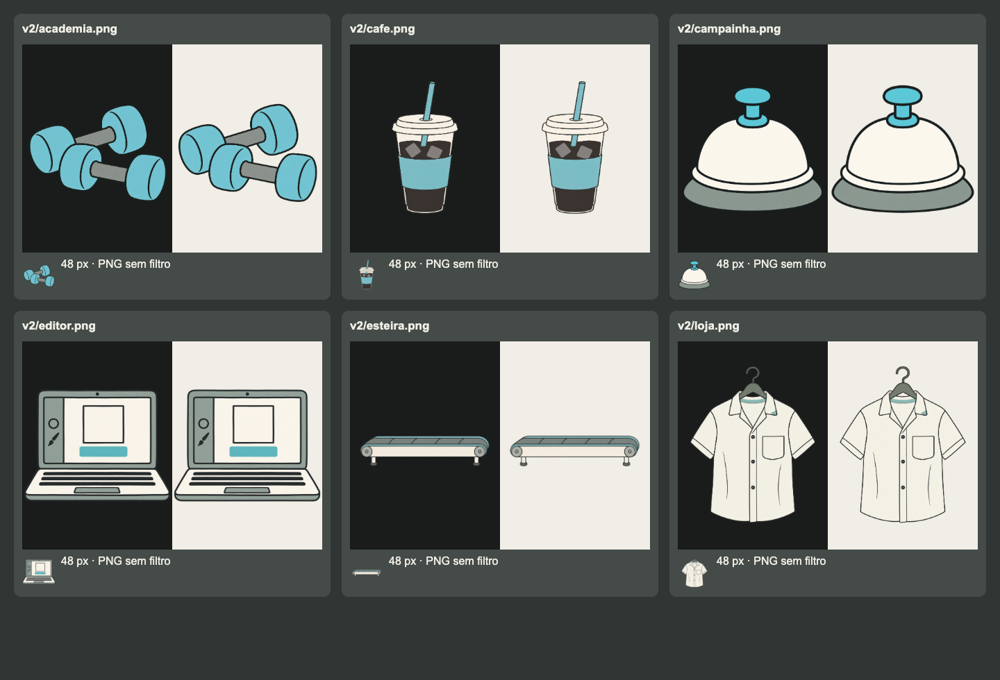
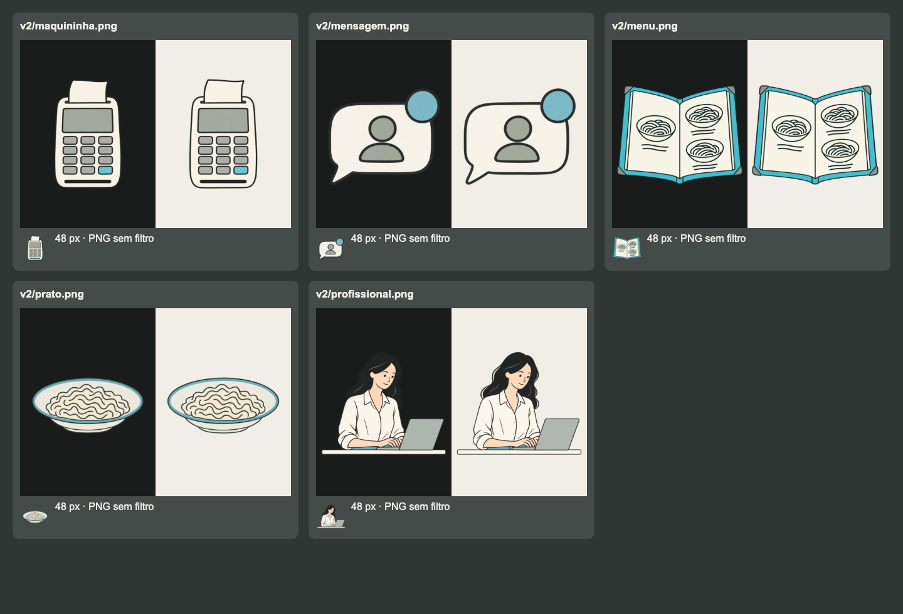

# Hermes em Operação: onze ilustrações revisadas

Entrega de 11/09/2026, a partir da [auditoria inicial](../ilustracoes-hermes-operacao/README.md). O usuário autorizou as onze correções, reforçou o fundo transparente e aprovou o copo como referência para as próximas gerações.

As onze novas imagens são PNGs com transparência real, conferidos no canal alfa e no Chrome sobre marfim e carvão. A atualização usa dez delas nas nove partes de T1E2. A esteira raster revisada fica disponível no acervo; o mecanismo interativo continua usando seus trilhos e estados próprios.

## Alterações

| Imagem | Ajuste |
|---|---|
| Campainha | Acabamento plano, sem reflexos brancos ou base metálica. |
| Menu | Três opções simplificadas, sem os acentos amarelo, laranja e verde. |
| Prato | Massa indicada por poucas linhas, sem render de fios e brilho. |
| Academia | Halteres sem reflexos de plástico, barras neutras. |
| Café | Copo aprovado como referência: poucos detalhes, gelo simples, sem reflexos e costuras. |
| Esteira | Menos segmentos, sem parafusos e detalhes mecânicos. Asset sem uso direto na página. |
| Maquininha | Vista frontal, corpo claro e contraste melhor em fundo escuro. |
| Editor | Teclado e ferramentas simplificados, maior área útil. |
| Loja | Menos dobras e costuras, cabide mais legível. |
| Mensagem | Silhueta maior no arquivo, legível nas etapas pequenas. |
| Profissional | Enquadramento de busto com laptop, preservando a personagem. |

Os 21 PNGs anteriores foram preservados byte a byte, incluindo os dez já aderentes. As referências novas usam `art/v2/`; não há filtro de CSS para simular a correção. Textos, comandos, vídeos, etapas, escolhas e estados de instalação não mudaram.

## Referência e geração

- [Padrão canônico e copo aprovado](../../design.md#referência-aprovada-copo-transparente).
- [Prompts enviados à geração integrada](../../site/assistir/hermes-em-operacao/t1e2/art/v2/prompts.json). O modelo não foi exposto pela ferramenta.
- [Inventário com dimensões, alfa e hashes](assets.json).

As tentativas RGB com quadriculado gravado foram rejeitadas. As finais foram geradas/editadas pela ferramenta de imagens do Codex e copiadas sem recorte ou remoção de fundo por script. O Python foi usado somente para ler metadados, conferir hashes e organizar os arquivos. A transparência não é inferida da aparência da prévia.

## Conferência visual

As duas pranchas abaixo são capturas do Chrome: cada arte aparece sobre carvão e marfim, mais uma miniatura de 48 px. Nenhuma prancha foi usada como asset do produto.

As nove páginas foram capturadas antes e depois em 1440, 768 e 390 px, totalizando 54 capturas. Nos 27 carregamentos depois da alteração: nenhum erro de JavaScript, nenhuma imagem quebrada e nenhum overflow horizontal. Os registros estão em [antes](before.json) e [depois](after.json).

| Página | Antes | Depois |
|---|---|---|
| Restaurante | [1440](before/index-1440.png) · [768](before/index-768.png) · [390](before/index-390.png) | [1440](after/index-1440.png) · [768](after/index-768.png) · [390](after/index-390.png) |
| Monte o fluxo | [1440](before/pratica-1440.png) · [768](before/pratica-768.png) · [390](before/pratica-390.png) | [1440](after/pratica-1440.png) · [768](after/pratica-768.png) · [390](after/pratica-390.png) |
| Equipe | [1440](before/equipe-1440.png) · [768](before/equipe-768.png) · [390](before/equipe-390.png) | [1440](after/equipe-1440.png) · [768](after/equipe-768.png) · [390](after/equipe-390.png) |
| Eugência | [1440](before/eugencia-1440.png) · [768](before/eugencia-768.png) · [390](before/eugencia-390.png) | [1440](after/eugencia-1440.png) · [768](after/eugencia-768.png) · [390](after/eugencia-390.png) |
| Eugência prática | [1440](before/eugencia-pratica-1440.png) · [768](before/eugencia-pratica-768.png) · [390](before/eugencia-pratica-390.png) | [1440](after/eugencia-pratica-1440.png) · [768](after/eugencia-pratica-768.png) · [390](after/eugencia-pratica-390.png) |
| Novo cliente | [1440](before/novo-cliente-1440.png) · [768](before/novo-cliente-768.png) · [390](before/novo-cliente-390.png) | [1440](after/novo-cliente-1440.png) · [768](after/novo-cliente-768.png) · [390](after/novo-cliente-390.png) |
| Cliente prática | [1440](before/cliente-pratica-1440.png) · [768](before/cliente-pratica-768.png) · [390](before/cliente-pratica-390.png) | [1440](after/cliente-pratica-1440.png) · [768](after/cliente-pratica-768.png) · [390](after/cliente-pratica-390.png) |
| Base do negócio | [1440](before/base-negocio-1440.png) · [768](before/base-negocio-768.png) · [390](before/base-negocio-390.png) | [1440](after/base-negocio-1440.png) · [768](after/base-negocio-768.png) · [390](after/base-negocio-390.png) |
| Jornada da marca | [1440](before/jornada-marca-1440.png) · [768](before/jornada-marca-768.png) · [390](before/jornada-marca-390.png) | [1440](after/jornada-marca-1440.png) · [768](after/jornada-marca-768.png) · [390](after/jornada-marca-390.png) |

No celular, a entrada da jornada já ocultava a ilustração para priorizar o formulário; esse comportamento foi preservado. As capturas registram estados iniciais das páginas. Checks e resultado de integração ficam no [PR 76](https://github.com/AgentsFlix/skills/pull/76).

## Validação da entrega

- 76 testes Python aprovados; `check_site.py` sem erros.
- 52 skills válidas; scanner sem bloqueios; `build_docs.py` sem alterações em `docs/` ou `catalog.json`.
- [27 cenários de interação aprovados](interactions.json) no roteiro existente `tests/mobile_exercises.cjs`: toque, teclado, arraste, correção, rodadas e reinício. Inclui as três atividades que reutilizam as ilustrações nas peças e nos seletores.
- Os dez PNGs v2 ativos foram carregados pelas páginas. Todos os onze finais têm alfa 0–255. Os 21 originais foram comparados por bytes com a base da auditoria.
