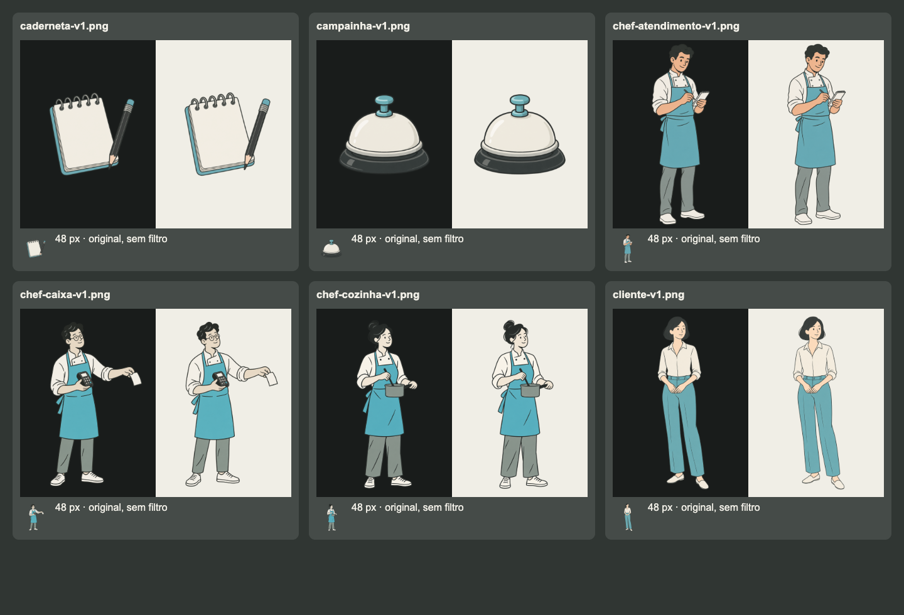
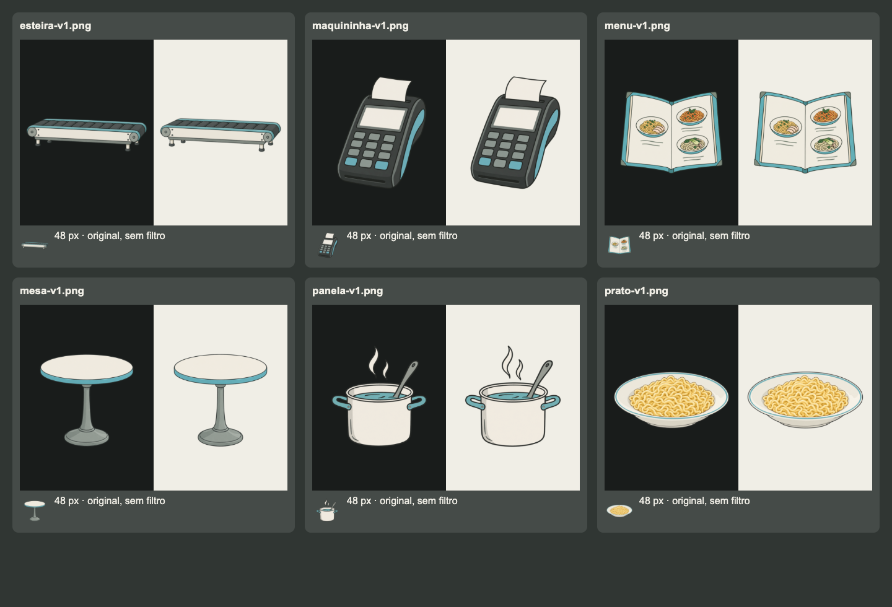
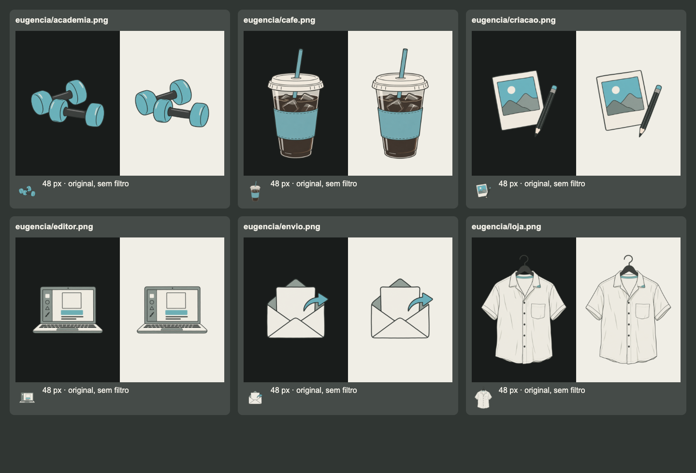
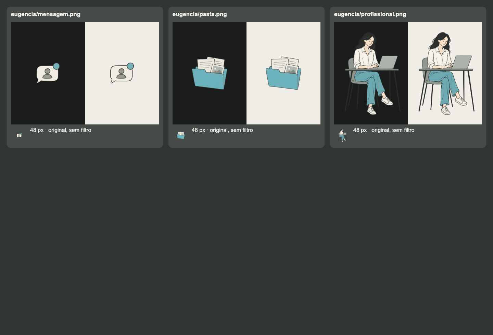

# Auditoria das ilustrações dos materiais de Hermes em Operação

Data: 10/09/2026. Referência: direção editorial aprovada `agentflix-desenho`, consolidada em [design.md](../../design.md#ilustrações-editoriais-padrão-de-criação). Base auditada: `b6cc4f496c5f6bf1674b1bd9cf814cb26f568aad` de `AgentsFlix/skills`.

**O acervo ainda não está totalmente padronizado.** Das 21 ilustrações únicas encontradas, 10 estão aderentes no uso principal, 6 precisam de refinamento de detalhe, contraste ou escala e 5 têm desvios mais evidentes de acabamento ou paleta. Essa classificação é uma avaliação visual, não uma aprovação editorial nova nem uma pontuação automática.

O pedido foi de checagem e documentação. Os arquivos das imagens e as páginas dos materiais foram preservados. As recomendações abaixo orientam um próximo lote de ajustes, sem anunciar que as imagens já foram corrigidas.

## Cobertura

O catálogo desta versão registra um material da série, **temporada 1, episódio 2**, com nove partes. O inventário inclui as 12 ilustrações do restaurante e as 9 da Eugência, contando cada arquivo uma vez, mesmo quando aparece em várias páginas. Inclui também `esteira-v1.png`, presente no acervo, mas sem referência encontrada nos HTML/JS das partes. As esteiras em movimento são mecanismos SVG distintos desse PNG.

| Parte | Página | Família de imagens |
|---|---|---|
| 1. O restaurante de Miojo Premium | [index.html](../../site/assistir/hermes-em-operacao/t1e2/index.html) | Restaurante |
| 2. Monte o fluxo do restaurante | [pratica.html](../../site/assistir/hermes-em-operacao/t1e2/pratica.html) | Restaurante |
| 3. Divida o trabalho entre os chefs | [equipe.html](../../site/assistir/hermes-em-operacao/t1e2/equipe.html) | Restaurante |
| 4. Conheça a Eugência | [eugencia.html](../../site/assistir/hermes-em-operacao/t1e2/eugencia.html) | Eugência |
| 5. Monte o fluxo da Eugência | [eugencia-pratica.html](../../site/assistir/hermes-em-operacao/t1e2/eugencia-pratica.html) | Eugência |
| 6. Receba um novo cliente | [novo-cliente.html](../../site/assistir/hermes-em-operacao/t1e2/novo-cliente.html) | Eugência |
| 7. Converse com três clientes | [cliente-pratica.html](../../site/assistir/hermes-em-operacao/t1e2/cliente-pratica.html) | Eugência |
| 8. Construa a base do negócio | [base-negocio.html](../../site/assistir/hermes-em-operacao/t1e2/base-negocio.html) | Eugência e mockups editáveis |
| 9. Monte a base da sua marca | [jornada-marca.html](../../site/assistir/hermes-em-operacao/t1e2/jornada-marca.html) | Eugência e mockups editáveis |

Fontes da cobertura: `site/assistir/series.json`, `episode-navigation.js`, `<image>` do restaurante, mapeamentos de `stage-identity.js` e funções `art()` dos módulos das atividades. O inventário técnico com dimensões, alpha e SHA-256 está em [inventario.json](inventario.json).

Capas cinematográficas da série, frames do vídeo e peças ainda não integradas à main não fazem parte desta auditoria de ilustração dos materiais. Ícones SVG de som, setas, números e trilhos funcionais não são personagens ilustrativos. Os SVGs de `mockup-bank.js` e os exemplos editáveis mostram identidades escolhidas no exercício; suas cores não são, por si só, desvios da marca AgentFlix.

## Como foi conferido

- Inspeção individual dos 21 PNGs originais e leitura dos dois registros de prompts publicados.
- Composição dos arquivos originais em Chrome sobre `#191C1B` e `#F0EEE6`, sem filtros, sombras ou tratamento dos pixels. Comparação adicional em caixas de 48 px.
- Captura do estado inicial das nove páginas em 1440, 768 e 390 px: 27 visualizações, sem erro JavaScript, imagem HTML não carregada ou overflow horizontal global nos estados observados. Isso não equivale a testar todas as respostas e etapas interativas.
- Inspeção das imagens reutilizadas e dos tamanhos efetivos no código. Assets de estados posteriores também foram examinados individualmente na galeria, mesmo quando não aparecem na primeira tela.
- Comparação de produção documentada em [producao.json](producao.json): os 21 PNGs e o catálogo público foram obtidos de `agentsflix.ai` e conferidos por SHA-256, com 22 correspondências de 22. As capturas das páginas correspondem à worktree auditada.

Todos os PNGs têm canal alpha e pixels transparentes. No Chrome, não foi observado fundo opaco, quadriculado desenhado ou halo amplo nas composições verificadas. Algumas prévias do visualizador de arquivos mostraram brilho no entorno que **não se reproduziu no navegador**. Portanto, esse efeito não foi classificado como defeito dos arquivos. Ter alpha, isoladamente, não garante borda limpa em todo contexto.

## Resultado por arquivo

**Aderente**: mantém a linguagem no uso principal; não exige substituição por motivo de estilo. **Refinar**: preserva a família, mas precisa de ajuste localizado. **Prioridade**: paleta ou acabamento destoam claramente do padrão. Os tons de pele e as identidades dos personagens existentes são preservados; funções diferentes não precisam usar a mesma pessoa.

Todos os caminhos abaixo são relativos a `site/assistir/hermes-em-operacao/t1e2/art/`.

| Arquivo | Avaliação | Evidência e encaminhamento |
|---|---|---|
| `caderneta-v1.png` | Aderente | Silhueta clara, pouco conteúdo interno e acento contido. Manter; evitar adicionar escrita ou detalhes de papel. |
| `campainha-v1.png` | **Prioridade** | Reflexos brancos curvos e base com brilho dão aparência de objeto polido. Retirar reflexos especulares e simplificar para massas chapadas. |
| `chef-atendimento-v1.png` | Aderente | Ação de anotar compreensível, adulto, roupa lisa e expressão discreta. Preservar identidade; a redução a ícone exige enquadramento próprio. |
| `chef-caixa-v1.png` | Aderente | Terminal e recibo explicam a função, com a mesma família de traço. Reduzir detalhes das teclas se criar uma versão pequena. |
| `chef-cozinha-v1.png` | Aderente | Postura e panela comunicam cozinhar; anatomia simples e paleta coerente. Preservar rosto, cabelo e roupa em novas poses. |
| `cliente-v1.png` | Aderente | Figura adulta, silenciosa e sem cenário desnecessário. Manter a identidade; a repetição na fila não exige uma nova arte. |
| `esteira-v1.png` | Refinar, uso não encontrado | Perspectiva e muitos roletes adicionam detalhe e volume. Se voltar a ser usada como ilustração, simplificar. Não substituir o mecanismo SVG animado apenas por existir este PNG. |
| `maquininha-v1.png` | Refinar | Função reconhecível, porém carcaça chanfrada e várias teclas aumentam volume/densidade. Simplificar a carcaça e agrupar os detalhes na variante pequena. |
| `menu-v1.png` | **Prioridade** | Amarelo, laranja e verde nos três pratos introduzem acentos extras; muitos fios e ingredientes. Usar pictogramas simples em marfim, carvão, cinza e um acento ciano. |
| `mesa-v1.png` | Aderente | Objeto isolado, boa silhueta e pouca informação interna. A perspectiva discreta explica apoio, sem exigir nova versão. |
| `panela-v1.png` | Aderente | Panela, colher e vapor formam uma única ação. Predominam massas claras com acento ciano; preservar essa simplicidade. |
| `prato-v1.png` | **Prioridade** | Macarrão amarelo e muitos fios com luz/sombra dominam a imagem. Redesenhar em massas claras com poucos traços que indiquem a comida. |
| `eugencia/academia.png` | **Prioridade** | Halteres têm reflexos brancos e faces com volume marcado, próximos de acabamento plástico. Manter a metáfora e retirar brilho e modelagem de luz. |
| `eugencia/cafe.png` | **Prioridade** | Gelo, transparência do copo, reflexos e costuras produzem muito detalhe; o marrom ocupa grande área. Representar café gelado com silhueta simples, líquido carvão e acento ciano, preservando o significado. |
| `eugencia/criacao.png` | Aderente | Imagem e lápis comunicam criar com poucos elementos e paleta coerente. Não acrescentar paisagem detalhada. |
| `eugencia/editor.png` | Refinar | O teclado e a barra de ferramentas acumulam detalhes; o objeto ocupa pouca área útil do PNG. Simplificar e ajustar escala aparente nas miniaturas. |
| `eugencia/envio.png` | Aderente | Envelope e seta têm leitura imediata e poucos elementos. Manter o significado e a seta dentro da mesma família. |
| `eugencia/loja.png` | Refinar | Camisa tem muitas dobras, costuras e pequenos botões; o cabide escuro perde contraste no fundo carvão. Reduzir detalhes e conferir silhueta no fundo real. |
| `eugencia/mensagem.png` | Refinar | Ideia é clara, mas o balão ocupa pouca área do PNG e fica muito menor que os demais na mesma caixa. Normalizar margem e escala aparente; manter o rótulo HTML. |
| `eugencia/pasta.png` | Aderente | Pasta e documentos formam um foco claro, com paleta controlada. Preservar a leitura geral; não adicionar texto aos documentos. |
| `eugencia/profissional.png` | Refinar | A cena grande mantém o estilo. Pernas da cadeira/mesa se confundem com o fundo; corpo inteiro e mobiliário perdem leitura no ícone da etapa Agente. Conferir contraste e criar enquadramento simples da mesma personagem para esse uso. |

## Comparação visual

Cada prancha mostra o **mesmo PNG original** sobre fundo escuro e claro e uma amostra em caixa de 48 px. As capturas registram o estado encontrado, sem corrigir as artes.

## Ordem sugerida para os ajustes

1. **Uniformizar acabamento e paleta das cinco prioridades**: campainha, menu, prato, academia e café. Manter as metáforas e os textos já aprovados. Fazer um piloto de objeto antes de regenerar o lote.
2. **Preparar o uso pequeno**: escala aparente de mensagem/editor, versão simples da profissional para a etapa Agente, menos teclas e dobras em maquininha/camisa. Normalizar as margens sem cortar cabeça, mãos, pés, seta ou cabide.
3. **Conferir o conjunto no produto**: comparar as seis etapas lado a lado e as figuras nas atividades em desktop/tablet/celular. Preservar o significado e a identidade de cada personagem. Rever o contraste dos contornos escuros sem aplicar glow.
4. **Tratar a esteira só se houver uso definido**: não gerar uma substituição para um arquivo sem referência encontrada. Registrar explicitamente seu destino se ele voltar ao produto.

Nenhuma dessas recomendações pede aplicação de filtro global, dessaturação das capas, troca de comandos ou mudança das identidades escolhidas pelo aluno nos mockups.

## Validação da entrega

- Python 3.11 com PyYAML 6.0.3: 73 testes aprovados, sem testes omitidos.
- `scripts/check_site.py`: zero erros. `scripts/validate_skills.py`: 52 skills válidas.
- `scripts/scan_skills.py`: 52 skills, nenhuma bloqueada, verificador fixado pelo repositório.
- `scripts/build_docs.py`: arquivos gerados sem diferença em `docs/` e `catalog.json`.
- Links locais do padrão e relatório e hashes dos 21 originais conferidos.
- [Registro das 27 visualizações no navegador](navegador.json), com tamanho renderizado e requisições observadas. As quatro pranchas acima são as evidências visuais versionadas da comparação.

## Reprodução e manutenção

Os prompts históricos estão em [art/prompts.md](../../site/assistir/hermes-em-operacao/t1e2/art/prompts.md) e [art/eugencia/prompts.md](../../site/assistir/hermes-em-operacao/t1e2/art/eugencia/prompts.md). Eles registram a intenção de traço editorial e geração com transparência, mas não substituem a conferência do resultado. O prompt-base canônico e os critérios de entrega ficam em [design.md](../../design.md#ilustrações-editoriais-padrão-de-criação).

Para auditar novamente, partir do catálogo e da navegação reais, listar todos os assets, comparar hashes e abrir cada arquivo nos dois fundos e nos tamanhos de uso. Registrar a versão/commit e distinguir arquivos carregados nas telas observadas, usados em outros estados e apenas presentes na pasta. Não declarar uma imagem nova aprovada com base nesta avaliação do lote antigo.
