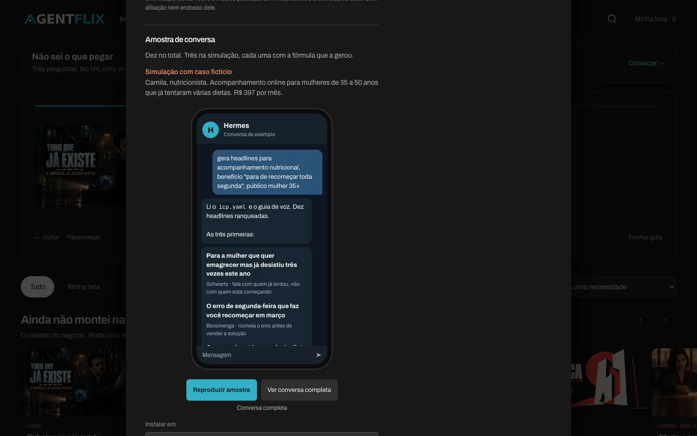
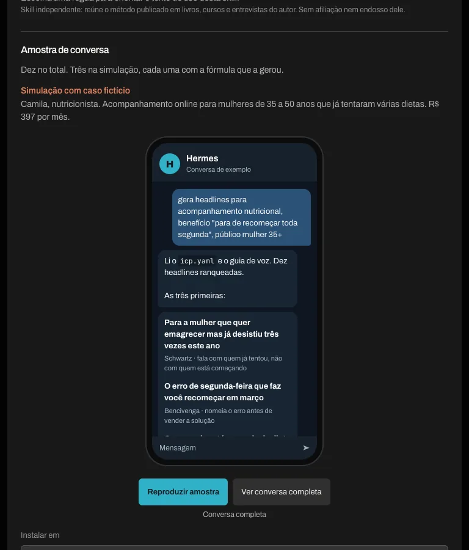
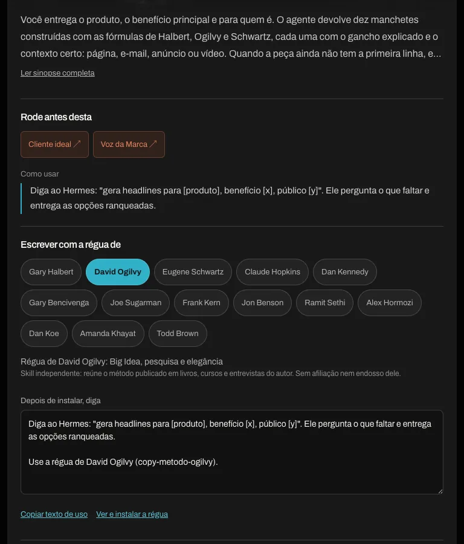

# Reorganização por necessidade e onboarding

Revisão local em `feat/vitrine-onboarding`. Base: `af69a31`. Nenhum novo PR ou publicação.

A curadoria e os roteiros vêm do protótipo do Zé. A implementação mantém a instalação e os recursos da vitrine real.

## Fluxo

Duas portas → seis fileiras por necessidade → ficha com dependências, régua e amostra → plataforma e comando de instalação. O guia oferece uma alternativa de até três perguntas.

## Capturas

Chrome real em 1440, 768 e 390 px, altura 900, escala 1. A imagem anterior usa o destaque fixado em Tecnologia e IA; a entrada nova começa pela escolha do usuário.

## 1440 px

| Antes | Nova entrada |
|---|---|
|  |  |

| Guia | Ficha |
|---|---|
|  |  |

| Amostra | Régua |
|---|---|
|  |  |

## 768 px

| Antes | Nova entrada |
|---|---|
|  |  |

| Guia | Ficha |
|---|---|
|  |  |

| Amostra | Régua |
|---|---|
|  |  |

## 390 px

| Antes | Nova entrada |
|---|---|
|  |  |

| Guia | Ficha |
|---|---|
|  |  |

| Amostra | Régua |
|---|---|
|  |  |

## Verificação

- 19 testes unitários e check_site sem erros.
- 29 caminhos do guia, todos terminando em uma skill em até três respostas.
- 37 skills nas seis fileiras, 14 réguas e seis amostras.
- Comparação de 408 comandos no DOM e clipboard.
- Busca, lista, hover, foco, teclado, pausa da amostra e movimento reduzido.
- Sem overflow nas três larguras.
- Curadoria ausente ou incompatível mantém o catálogo completo.

As amostras são simulações escritas, sem contato com Telegram ou agentes reais. A régua altera o texto de uso, separado do instalador. O player e seus dados não mudaram nesta reorganização.
